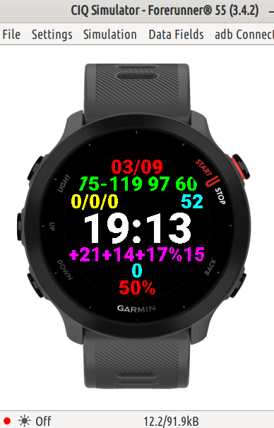

| СКРИНШОТ                        | ОПИСАНИЕ ПОЛЕЙ                                                                                                                                                                   |
| ------------------------------- | -------------------------------------------------------------------------------------------------------------------------------------------------------------------------------- |
|  | МЕСЯЦ/ЧИСЛО МИН.НОЧ.ПУЛЬС-МАКС СРЕДНИЙ RHR УПРАЖН.СЕГОДНЯ/ЗА НЕДЕЛЮ/ФАЙЛОВ СТРЕСС ЗА НОЧЬ ВРЕМЯ ПОГОДА:6УТРА 12ДНЯ 6ВЕЧЕРА ПРОЦЕНТ ОСАДКОВ ШАГОВ БАТАРЕЯ |

ctrl+f5 запустить в эмуляторе

ctrl+shift+p -> Monkey C: Build for Device собрать пакет для часов
